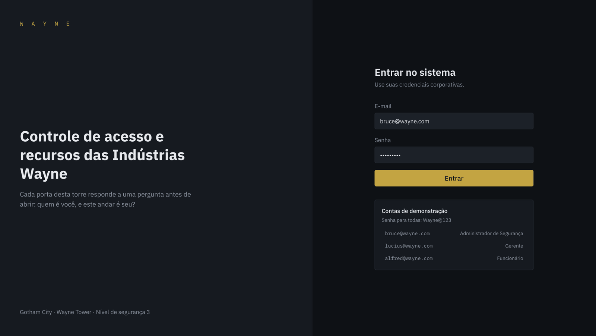
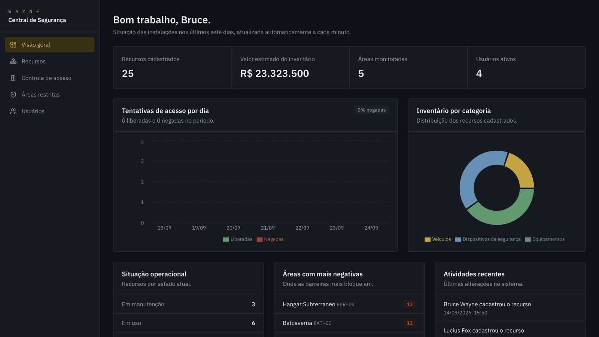
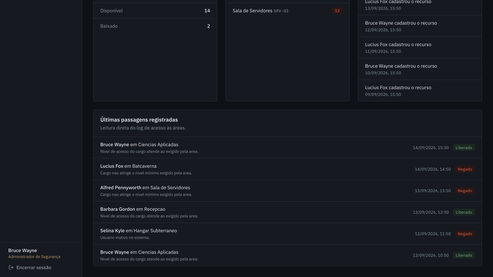
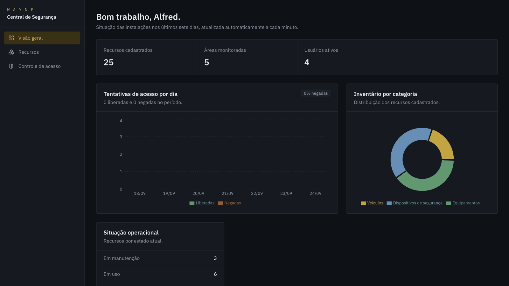

# Indústrias Wayne — Sistema de Gerenciamento de Segurança e Recursos

Aplicação web full stack para controle de acesso a áreas restritas, gestão do inventário
interno e visualização de indicadores das Indústrias Wayne.

Projeto final do curso Dev Full Stack — Infinity School.


## Links

| | |
|---|---|
| **Aplicação no ar** | https://wayne-industries-web.vercel.app |
| **API** | https://wayne-api-1vh8.onrender.com/api/v1/health |
| **Repositório** | https://github.com/BlackJoness/wayne-industries |

Entre com `bruce@wayne.com` e a senha `Wayne@123` para ver o perfil de Administrador de
Segurança, depois com `alfred@wayne.com` para comparar com o perfil de Funcionário.

> A API está hospedada em plano gratuito e hiberna após alguns minutos sem uso.
> A primeira abertura pode levar cerca de um minuto.

---

## Telas

| Login | Painel do Administrador de Segurança |
|---|---|
|  |  |

| Registro de acessos | Painel do Funcionário |
|---|---|
|  |  |

O mesmo painel muda conforme quem entra: o Funcionário não vê o valor do inventário nem
as telas de áreas e usuários, porque a API não envia esses campos para o cargo dele.

---

## Do enunciado ao produto

O briefing tinha três páginas e nenhuma especificação técnica. O primeiro trabalho não foi
escrever código: foi transformar frases como "dashboard visualmente atraente" em requisitos
com critério de aceite.

### Como cada frase do enunciado virou requisito

| Enunciado | Virou | Por quê |
|---|---|---|
| "Controle de acesso que permita apenas usuários autorizados a acessar áreas restritas" | Entidade **Área** com nível mínimo exigido, endpoint de tentativa de entrada e registro em `access_logs` com o resultado e o motivo de cada decisão. A regra vive numa função pura (`access.policy.ts`) que avalia, nesta ordem: usuário inativo, área inativa, permissão individual válida, hierarquia de cargo | Só login não é controle de acesso. Sem registro, não há como auditar quem tentou entrar onde |
| "Autenticação e autorização para funcionários, gerentes e administradores de segurança" | JWT assinado com segredo de ambiente, senha com bcrypt, limite de dez tentativas de login a cada dez minutos, middlewares `authenticate` e `authorize` no servidor e permissão individual além do cargo | Esconder botão na tela não protege nada. A regra vive no backend ([ADR 0004](docs/adrs/0004-autorizacao-no-backend.md)) |
| "Interface para gerenciar equipamentos, veículos e dispositivos de segurança" | CRUD de recursos com busca por nome ou número de série, filtros por categoria e situação, paginação no servidor e validação com Zod. Funcionário consulta, gerente cadastra e edita, só o administrador exclui. Toda alteração alimenta `audit_logs` | O requisito real era permissão diferente por perfil, não o formulário |
| "Painel de controle visualmente atraente com dados relevantes" | Totais do inventário, série diária de acessos liberados e negados nos últimos sete dias, distribuição de recursos, ranking de áreas com mais negativas e atividades recentes, tudo por agregação real no PostgreSQL e filtrado pelo cargo de quem consulta | "Atraente" não é requisito. Quais números, de onde vêm e quem vê cada um, é |

### O que ficou de fora, e por quê

| Cortado | Motivo | Onde está registrado |
|---|---|---|
| Refresh token | Prazo de uma semana. JWT único de 8 horas atende ao uso interno | [Próximos passos](#próximos-passos) |
| Testes end-to-end de interface | A lógica de autorização mora no backend, e é lá que os 52 testes estão | [Testes](#testes) |
| Upload de foto do recurso | Não está no enunciado | [Próximos passos](#próximos-passos) |

### Onde as decisões estão registradas

| ADR | Decisão |
|---|---|
| [0001](docs/adrs/0001-monorepo-com-npm-workspaces.md) | Monorepo com npm workspaces |
| [0002](docs/adrs/0002-arquitetura-em-camadas-por-modulo.md) | Arquitetura em camadas por módulo |
| [0003](docs/adrs/0003-motor-de-politica-de-acesso-isolado.md) | Motor de política de acesso isolado |
| [0004](docs/adrs/0004-autorizacao-no-backend.md) | Autorização no backend |
| [0005](docs/adrs/0005-permissao-individual-alem-do-cargo.md) | Permissão individual além do cargo |

Trade-offs menores (conteúdo do token, sessão, CORS) estão em [Decisões conscientes](#decisões-conscientes).

---

## Credenciais de demonstração

Senha para todas as contas: **`Wayne@123`**

| Perfil | E-mail | O que este perfil pode fazer |
|---|---|---|
| Administrador de Segurança | `bruce@wayne.com` | Tudo: usuários, áreas, permissões e exclusão de recursos |
| Gerente | `lucius@wayne.com` | Cadastra e edita recursos, audita acessos das suas áreas |
| Funcionário | `alfred@wayne.com` | Consulta recursos e registra as próprias entradas |
| Funcionário com exceção | `barbara@wayne.com` | Funcionário com permissão individual na Sala de Servidores |
| Usuário inativo | `selina@wayne.com` | Demonstra o bloqueio de login por conta desativada |

Entre com perfis diferentes para ver a interface e as permissões mudarem.

---

## Como rodar localmente

Pré-requisitos: **Node 20 ou superior** e **Docker**.

```bash
cp .env.example .env
cp apps/api/.env.example apps/api/.env
cp apps/web/.env.example apps/web/.env
docker compose up -d
npm run setup
```

Cada aplicação carrega o próprio `.env`, porque é do diretório dela que o Prisma e o Vite
são executados. O `.env` da raiz serve apenas às credenciais do container PostgreSQL.

O `npm run setup` instala as dependências, gera o Prisma Client, aplica as migrations e
popula o banco com os dados de demonstração. Depois disso:

```bash
npm run dev:api    # http://localhost:3333/api/v1
npm run dev:web    # http://localhost:5173
```

Abra <http://localhost:5173> e entre com uma das contas da tabela acima.

### Sem Docker

Suba um PostgreSQL local e ajuste `DATABASE_URL` em `apps/api/.env` para apontar para ele.
O restante dos comandos é igual.

---

## Arquitetura

```
wayne-industries/
├── docker-compose.yml          # PostgreSQL 16
├── .env.example                # credenciais do container
├── docs/
│   ├── adrs/                   # 5 decisões arquiteturais registradas
│   ├── api.md                  # referência completa de endpoints
│   └── wayne-api.postman.json  # coleção para Insomnia ou Postman
├── apps/api/
│   ├── .env.example            # DATABASE_URL, JWT_SECRET, CORS_ORIGIN
│   ├── prisma/
│   │   ├── schema.prisma       # 6 modelos, 5 enums
│   │   └── seed.ts             # dados de Gotham para demonstração
│   ├── tests/                  # 52 testes (Vitest + Supertest)
│   └── src/
│       ├── config/             # env validado com Zod, cliente Prisma
│       ├── shared/
│       │   ├── errors/         # AppError e subclasses por status
│       │   ├── middlewares/    # authenticate, authorize, validate, errorHandler
│       │   └── utils/          # jwt, bcrypt, paginação, hierarquia de cargos
│       └── modules/
│           ├── auth/  users/  areas/  access/  resources/  dashboard/  audit/
│           └── (cada um: routes → controller → service → repository)
└── apps/web/src/
    ├── api/                    # cliente HTTP e hooks do React Query
    ├── contexts/               # sessão do usuário
    ├── routes/                 # ProtectedRoute e RoleGuard
    ├── components/             # primitivos de UI e layout
    └── features/               # auth, dashboard, resources, access, areas, users
```

A dependência aponta sempre para dentro. Só a camada de repositório conhece o Prisma, e
o serviço recebe o repositório por injeção no construtor. É isso que permite testar as
regras de negócio sem subir banco.

O raciocínio por trás de cada escolha está em [`docs/adrs/`](docs/adrs/).

---

## Matriz de permissões

| Ação | Funcionário | Gerente | Administrador |
|---|:---:|:---:|:---:|
| Ver o painel (números agregados) | sim | sim | sim |
| Ver o valor do inventário no painel | não | sim | sim |
| Ver acessos de terceiros no painel | não | sim | sim |
| Ver a trilha de auditoria no painel | não | não | sim |
| Consultar recursos | sim | sim | sim |
| Cadastrar e editar recurso | não | sim | sim |
| Excluir recurso | não | não | sim |
| Registrar tentativa de acesso | sim | sim | sim |
| Ver o próprio histórico | sim | sim | sim |
| Auditar acessos de terceiros | não | suas áreas | todas |
| Gerenciar áreas e permissões | não | não | sim |
| Gerenciar usuários | não | não | sim |

A autorização é aplicada no servidor. O `RoleGuard` do React apenas esconde telas fora do
perfil; chamar a rota diretamente com um token de nível inferior devolve **403**.

O painel segue a mesma regra. `GET /dashboard` monta o payload conforme o cargo de quem
pede, e os campos restritos nem chegam a ser consultados no banco. O frontend decide o que
renderizar pela presença do campo, nunca pelo cargo: quem manda na autorização é a API.

Teste você mesmo, com a API rodando:

```bash
TOKEN=$(curl -s -X POST http://localhost:3333/api/v1/auth/login \
  -H "Content-Type: application/json" \
  -d '{"email":"alfred@wayne.com","password":"Wayne@123"}' | grep -o '"token":"[^"]*' | cut -d'"' -f4)

curl -i -X DELETE http://localhost:3333/api/v1/resources/qualquer-id \
  -H "Authorization: Bearer $TOKEN"
# HTTP/1.1 403 Forbidden
```

---

## Testes

```bash
npm test
```

52 testes cobrindo o que quebra em produção:

| Suíte | O que verifica |
|---|---|
| `access-policy.spec.ts` | O motor de decisão de acesso, incluindo permissão expirada e precedência do bloqueio por inatividade |
| `auth-service.spec.ts` | Login, bloqueio de conta inativa, e a garantia de que o hash da senha nunca sai na resposta |
| `resources-service.spec.ts` | CRUD, conflito de número de série, gravação da trilha de auditoria |
| `authorization.spec.ts` | A cadeia real de middlewares: 401 sem token, 403 fora do perfil, 400 com corpo inválido, token de conta desativada rejeitado, e ausência de stack trace |
| `users-service.spec.ts` | A trava que impede o administrador de rebaixar ou desativar a si mesmo, e o conflito de e-mail duplicado |
| `dashboard-service.spec.ts` | Que o payload do Funcionário não contém acessos de terceiros, auditoria nem valor do patrimônio |
| `cors-origin.spec.ts` | A política de origens, incluindo a rejeição de sites de terceiros publicados na Vercel |

Os serviços são testados com repositórios falsos injetados no construtor, sem depender de
banco. Isso mantém a suíte rápida e faz o CI rodar sem infraestrutura.

---

## Segurança aplicada

| Medida | Onde |
|---|---|
| Senha com bcrypt (10 rounds) | `shared/utils/password.ts` |
| JWT com segredo obrigatório de 16+ caracteres | `config/env.ts` |
| Validação e sanitização de toda entrada | `shared/middlewares/validate.ts` + schemas Zod |
| Cabeçalhos de segurança HTTP | `helmet` em `app.ts` |
| CORS restrito à origem configurada | `app.ts` |
| Limite de tentativas de login | `auth.routes.ts` |
| Erro padronizado, sem vazar stack trace | `shared/middlewares/error-handler.ts` |
| Mensagem de login idêntica para e-mail e senha errados | `auth.service.ts` |
| Exclusão lógica de usuários | `users.service.ts` |
| Administrador não consegue se auto-rebaixar | `users.service.ts` |
| Trilha de auditoria com autor e data | `audit_logs` |

---

## Deploy

| Camada | Serviço sugerido | Configuração |
|---|---|---|
| Banco | Neon | Copie a connection string para `DATABASE_URL` |
| API | Render ou Railway | Root: `apps/api` · Build: `npm install && npm run build` · Start: `npm run db:deploy && npm start` |
| Frontend | Vercel | Root: `apps/web` · Build: `npm run build` · Output: `dist` |

Variáveis na API: `DATABASE_URL`, `JWT_SECRET`, `CORS_ORIGIN` (a URL da Vercel), `NODE_ENV=production`.
Variável na Vercel: `VITE_API_URL` (a URL da API + `/api/v1`).

O `apps/web/vercel.json` já contém o rewrite de SPA, sem o qual recarregar uma rota
interna devolveria 404.

Depois do primeiro deploy, rode o seed uma vez para popular as contas de demonstração.

> No plano gratuito do Render o serviço hiberna após inatividade e a primeira chamada
> pode levar cerca de um minuto. Abra a URL da API antes de apresentar.

---

## Scripts

| Comando | O que faz |
|---|---|
| `npm run setup` | Instala, migra e popula o banco |
| `npm run dev:api` | API em modo watch |
| `npm run dev:web` | Frontend em modo watch |
| `npm test` | Suíte de testes da API |
| `npm run typecheck` | Checagem de tipos nas duas aplicações |
| `npm run build` | Build de produção das duas aplicações |
| `npm run db:studio` | Prisma Studio para inspecionar o banco |
| `npm run db:reset` | Recria o banco do zero e roda o seed |

---

## Modelo de dados

| Tabela | Papel |
|---|---|
| `users` | Pessoas, cargo e situação |
| `areas` | Áreas físicas e o nível mínimo exigido |
| `area_permissions` | Exceções individuais, com validade e autor da concessão |
| `access_logs` | Toda tentativa de entrada, com resultado e motivo |
| `resources` | Equipamentos, veículos e dispositivos de segurança |
| `audit_logs` | Quem alterou o quê e quando |

Duas camadas de permissão convivem de propósito: `areas.minimum_role` resolve o caso geral
e `area_permissions` resolve a exceção pontual, sem precisar promover ninguém para liberar
uma única porta. O detalhe está no [ADR 0005](docs/adrs/0005-permissao-individual-alem-do-cargo.md).

---

## Decisões conscientes

Pontos onde uma alternativa foi avaliada e descartada de propósito. Ficam registrados aqui
para não parecerem descuido.

| Decisão | Motivo | Custo aceito |
|---|---|---|
| O token JWT guarda só o `sub`; cargo e situação vêm do banco a cada requisição | Rebaixar ou desativar um usuário precisa ter efeito imediato. Com o cargo dentro do token, a mudança só valeria quando ele expirasse | Uma consulta adicional por requisição |
| Token guardado em `localStorage` | Simplicidade, e a sessão viaja no cabeçalho `Authorization`, que o navegador não anexa sozinho entre origens | Exposição a XSS. Cookie `httpOnly` seria mais seguro e é o caminho natural de evolução |
| CORS com `credentials: false` | Nada na aplicação depende de cookie entre origens | Migrar a sessão para cookie exigiria rever esta configuração |
| `validate` grava o resultado com `Object.assign` em `request.query` | Funciona no Express 4, que é a versão em uso | Quebra no Express 5, onde `req.query` virou somente leitura. Dívida conhecida, registrada aqui |
| Exclusão de usuário é lógica, não física | Preserva a integridade dos logs de acesso e da trilha de auditoria | O registro permanece na tabela |

---

## Próximos passos

Itens deliberadamente fora do escopo desta entrega, registrados para honestidade técnica:

- Refresh token com revogação, no lugar do JWT de 8 horas.
- Pacote `packages/shared` para tipos comuns entre API e frontend, eliminando a duplicação
  de contratos em `apps/web/src/api/types.ts`.
- Testes end-to-end de interface com Playwright.
- Upload de foto do recurso.

---

Feito por **Filipe Jones** · [LinkedIn](https://www.linkedin.com/in/filipe-jones/) · [GitHub](https://github.com/BlackJoness)
